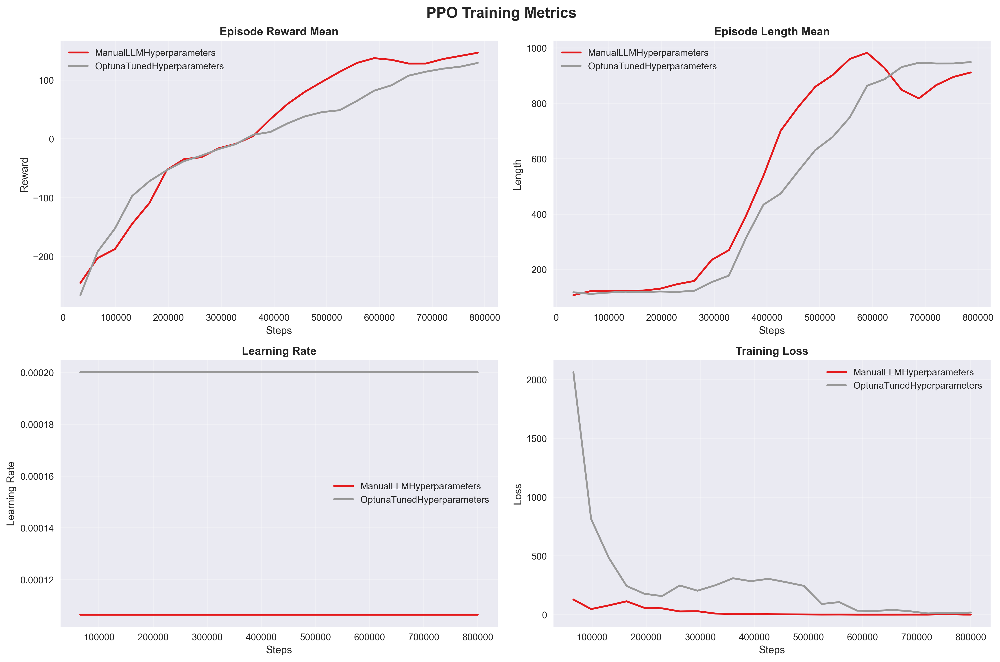
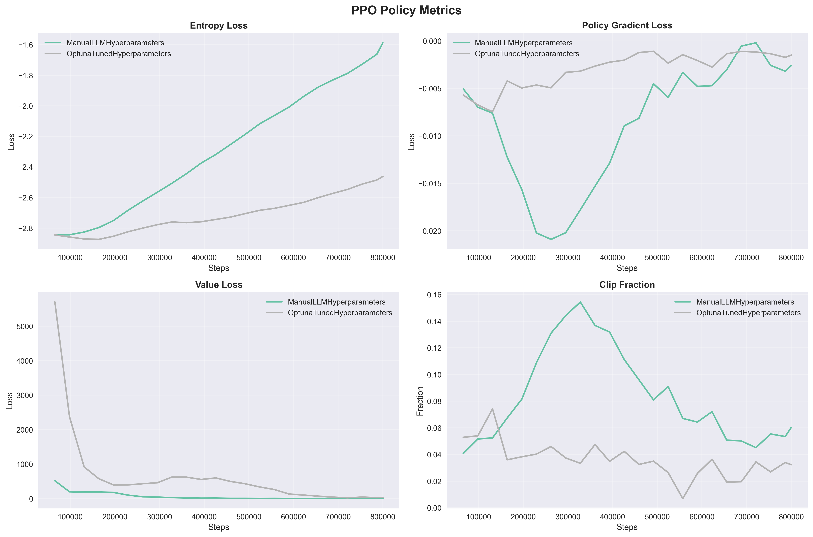
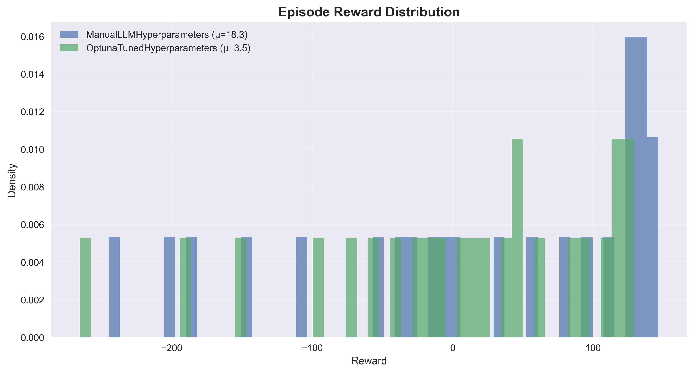
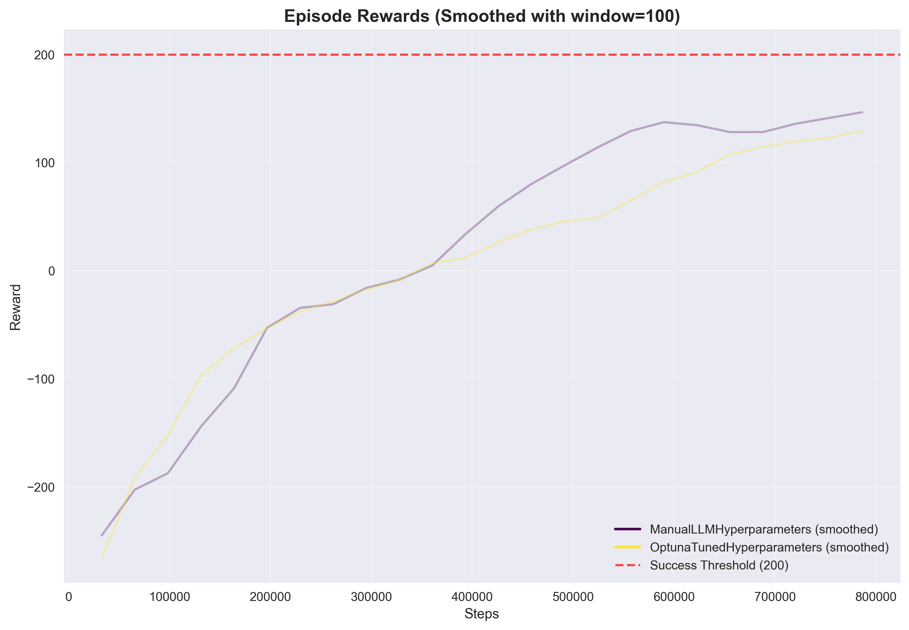
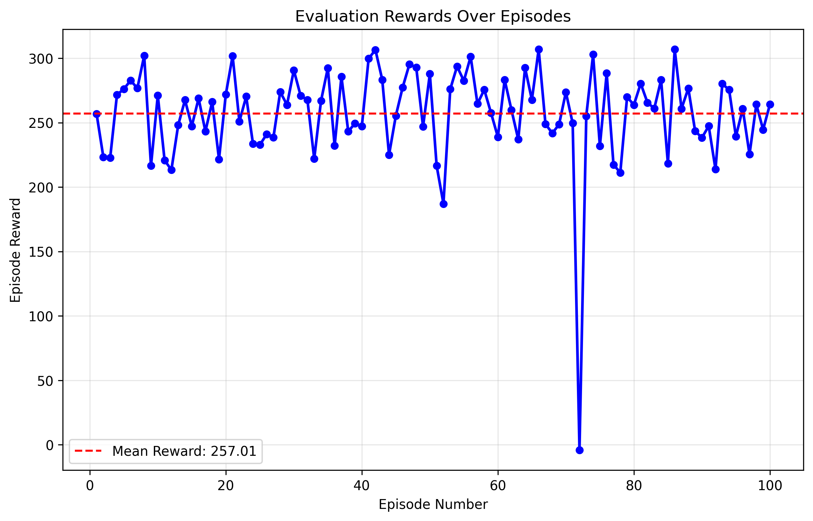
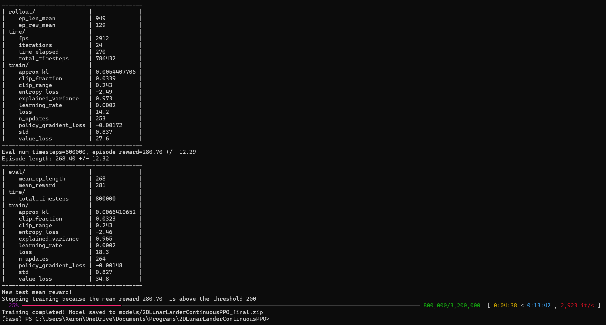
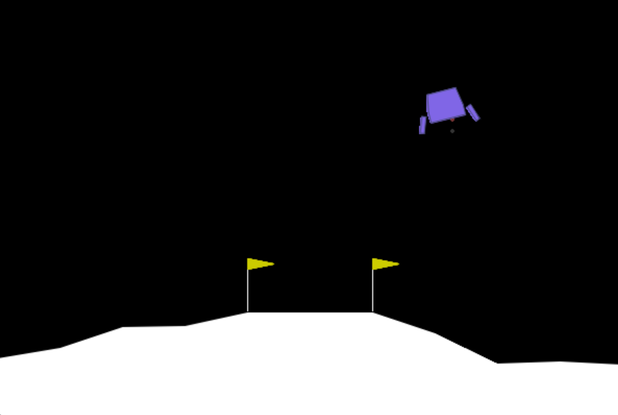
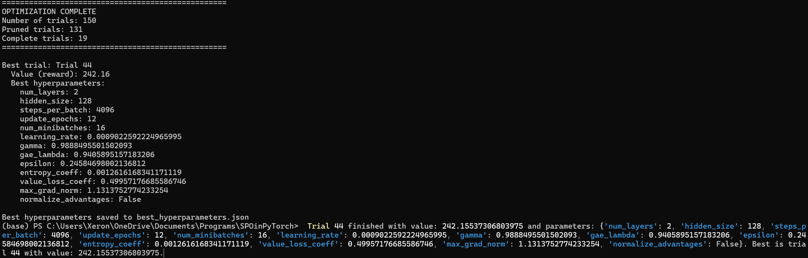
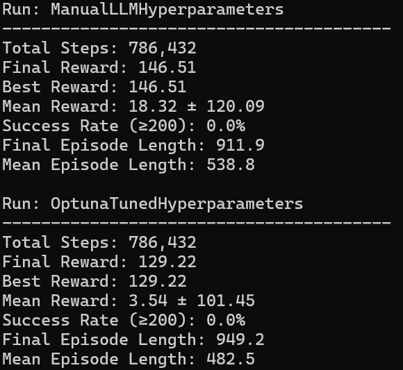

## 2D Lunar Lander Continuous Control with Proximal Policy Optimization (PPO).

A reproducible, SB3-based implementation of PPO for continuous control on the Gymnasium Lunar Lander environment (LunarLander-v3 with continuous controls). The project includes training, evaluation, TensorBoard driven visualization utilities, and Optuna hyperparameter tuning.

**Note: The models folder contains the pretrained model. ()**

---

## Algorithm Overview:

PPO optimizes a stochastic policy by maximizing a clipped surrogate objective that constrains policy updates to remain close to the behavior policy. In this project, the PPO algorithm is provided by Stable-Baselines3 (SB3), and is configured through code in this repository (see Implementation Section).

Key elements (as implemented by SB3 and configured here):
- Policy: Stochastic Gaussian policy for continuous actions with separate policy/value networks.
- Advantage estimation: Generalized Advantage Estimation (GAE).
- Clipped objective: Prevents overly large policy updates via ratio clipping.
- Value function loss and entropy bonus: Balances policy improvement, value accuracy, and exploration.

Mathematical foundations (standard PPO):
- Probability ratio: r_t(θ) = π_θ(a_t|s_t) / π_θ_old(a_t|s_t)
- Clipped objective (maximize):
  L^CLIP(θ) = E_t[ min( r_t(θ) Â_t, clip(r_t(θ), 1-ε, 1+ε) Â_t ) ]
- Value loss (minimize): L^VF(θ) = E_t[ (V_θ(s_t) - V_t^target)^2 ]
- Entropy bonus: L^ENT(θ) = E_t[ H[π_θ(·|s_t)] ]
- Final loss (minimize): L(θ) = -L^CLIP(θ) + c1 L^VF(θ) - c2 L^ENT(θ)

Continuous action handling:
- The policy outputs the mean and (diagonal) log-std of a Gaussian distribution per action dimension.
- Actions are sampled and then clipped by the environment bounds ([-1, 1] for LunarLander continuous). Gymnasium maps actions to engine controls internally.

Implementation notes for this repo:
- We use SB3 PPO with an MLP policy (separate pi/vf networks) and Tanh activations.
- Vectorized environments with SubprocVecEnv accelerate data collection.
- Evaluation is performed periodically via EvalCallback with an early stop on a success threshold.

---

## Implementation:

### Neural Network Architecture
- Policy network (pi): [128, 128] hidden units with Tanh activations
- Value network (vf): [128, 128] hidden units with Tanh activations
- Policy type: stable_baselines3 PPO with "MlpPolicy" and separate pi/vf nets (net_arch)

### Hyperparameters (from config.py):

| Name | Value | Description |
|---|---:|---|
| learning_rate | 0.00020008809615992198 | Adam learning rate |
| n_steps | 2048 | Rollout steps per environment before an update |
| batch_size | 256 | Minibatch size for SGD |
| n_epochs | 11 | Number of epochs per update |
| gamma | 0.997151183012025 | Discount factor |
| gae_lambda | 0.9803222253501476 | GAE λ for bias-variance trade-off |
| clip_range | 0.2433693624803069 | PPO ratio clipping ε |
| clip_range_vf | None | Value function clipping (disabled) |
| normalize_advantage | True | Normalize advantages before updates |
| ent_coef | 0.0013291011108410845 | Entropy coefficient c2 |
| vf_coef | 0.5 | Value loss coefficient c1 |
| max_grad_norm | 0.5 | Global gradient clipping |
| use_sde | False | State-dependent exploration (off) |
| sde_sample_freq | -1 | SDE resampling frequency |
| target_kl | None | KL target (no early stop by KL) |
| policy_kwargs.net_arch.pi | [128, 128] | Pi MLP hidden sizes |
| policy_kwargs.net_arch.vf | [128, 128] | Vf MLP hidden sizes |
| policy_kwargs.activation_fn | nn.Tanh | Activation function |
| verbose | 1 | SB3 verbosity |
| seed | 17 | Random seed |
| device | cpu | Device for training |

Additional configuration:
- ENV_NAME: "LunarLander-v3"
- ENV_KWARGS: {"continuous": True}
- N_ENVS: 16
- TOTAL_TIMESTEPS: 3_200_000
- EVAL_EPISODES: 10
- EvalCallback: eval_freq=50_000, n_eval_episodes=5, deterministic=True
- Early stop: StopTrainingOnRewardThreshold(reward_threshold=200)

### Training Procedure:
- Parallel rollout collection using 16 SubprocVecEnv workers.
- Each update uses 2048 steps per environment (i.e., 2048 × 16 transitions per PPO update in SB3’s vectorized rollout semantics) with minibatch SGD (batch_size=256) for 11 epochs.
- TensorBoard scalars (e.g., rollout/ep_rew_mean) are logged under logs/ for visualization.
- Periodic evaluation on a separate vectorized environment (1 env).
- Automatic best model saving; final model saved as models/2DLunarLanderContinuousPPO_final.zip.

---

## Project Structure:

```
2DLunarLanderContinuousPPO/
├─ config.py                      #Central configuration (env and PPO hyperparameters).
├─ train.py                       #Training entry point (SB3 PPO and EvalCallback).
├─ evaluate.py                    #Model evaluation script (CLI).
├─ hyperparameterOptimizer.py     #Optuna-based hyperparameter tuning.
├─ training_visualisation.py      #TensorBoard log parsing and plotting utilities.
├─ models/                        #Saved models and best checkpoints.
├─ logs/                          #TensorBoard logs and evaluation artifacts.
├─ results/                       #Exported plots generated by visualisation tools.
└─ visuals/                       #Static explanatory visuals for the README/project.
```

Data flow:
1. train.py reads Config, creates vectorized envs, and trains PPO (SB3), logging to logs/ and saving models/.
2. evaluate.py loads a saved model and computes episode returns; optionally saves a plot to results/.
3. training_visualisation.py parses TensorBoard event files in logs/ and exports figures to results/.
4. hyperparameterOptimizer.py runs Optuna trials to select PPO hyperparameters (using SB3 PPO internally).

Entry points:
- Training: train.py
- Evaluation: evaluate.py
- Visualization: training_visualisation.py
- Hyperparameter search: hyperparameterOptimizer.py

---

## Dependencies and Setup:

Tested with Python 3.11 on Windows 11. Recommended package set:
- stable-baselines3 >= 2.0.0
- gymnasium[box2d] >= 0.29.0
- torch >= 2.0.0
- tensorboard
- pandas, seaborn, matplotlib
- optuna

Install with pip:
```bash
pip install -r requirements.txt
```
Notes:
- Box2D may require build tools on some platforms. If installation fails, consult Gymnasium’s Box2D installation notes.
- GPU: set Config.PPO_PARAMS["device"] = "cuda" (and ensure a CUDA-enabled PyTorch is installed) to train on GPU, but CPU is recommended for MLpPolicy based tasks as it's faster.

---

## Usage Guide:

### Train:
```bash
python train.py
```
Behavior:
- Creates 16 parallel envs and trains for 3,200,000 timesteps.
- Logs TensorBoard metrics under logs/.
- Saves best model under models/2DLunarLanderContinuousPPO and final model at models/2DLunarLanderContinuousPPO_final.zip.
- Early-stops when evaluation reward ≥ 200.

TensorBoard (optional):
```bash
tensorboard --logdir logs
```

### Evaluate
```bash
python evaluate.py --model models\2DLunarLanderContinuousPPO_final.zip --episodes 100 --plot
```
Arguments:
- --model: path to .zip model
- --episodes: number of evaluation episodes (default: Config.EVAL_EPISODES)
- --no-render: disable onscreen rendering
- --plot: save a per episode reward plot to results/

### Visualize Training Logs"
```bash
python training_visualisation.py --log-dir logs/ --smooth-window 100
```
Flags:
- --no-show: only save plots
- --no-save: only display plots

### Hyperparameter Tuning (Optuna):
```bash
python hyperparameterOptimizer.py
```
Behavior:
- Runs 50 trials by default; each trial trains 200,000 timesteps and evaluates via evaluate_policy.
- Suggests learning rate, n_steps, batch_size, n_epochs, gamma, gae_lambda, clip_range, ent_coef, and net_arch size.

---

## Results and Analysis

All referenced paths are relative to the repository root.

results: Shows a comparison between the manually-tuned and Optuna-tuned hyperparameters.
- results/training_metrics_YYYYMMDD_HHMMSS.png
  - 2×2 grid of line plots over training steps:
    - Episode reward mean (rollout/ep_rew_mean).
    - Episode length mean (rollout/ep_len_mean).
    - Learning rate (train/learning_rate).
    - Training loss (train/loss).
  - Shows learning dynamics, stability, and convergence trends across runs.




- results/policy_metrics_YYYYMMDD_HHMMSS.png
  - 2×2 grid of policy-related metrics:
    - Entropy loss (train/entropy_loss): exploration over time
    - Policy gradient loss (train/policy_gradient_loss): update magnitudes
    - Value loss (train/value_loss): critic accuracy



    - Clip fraction (train/clip_fraction): share of updates hitting the clip
  - Useful for diagnosing under/over-constraint and bias-variance behavior.




- results/reward_distribution_YYYYMMDD_HHMMSS.png
  - Histogram of episode reward means across training; density-scaled.
  - Illustrates overall performance distribution and variability.




- results/smoothed_rewards_YYYYMMDD_HHMMSS.png
  - Rewards over steps with moving average smoothing, plus a red dashed line at +200 (success threshold).
  - Highlights when the agent first crosses the success criterion and the stability thereafter.




- results/evaluation_rewards_2DLunarLanderContinuousPPO_final.png
  - Line plot of per-episode rewards during a post-training evaluation run.
  - Includes a horizontal mean-reward line; demonstrates final policy quality and variance.

visuals:
- visuals/2DLunarLanderPPOTraining.png
  - High-level conceptual illustration of PPO training for Lunar Lander (diagram/flow). Contextual material.



- visuals/2DLunarLanderVisual.png
  - Static depiction of the environment (lander, terrain, landing pad).



- visuals/HyperOptVisual.png
  - Schematic showing hyperparameter tuning process or comparison.



- visuals/ManualLLMvsOptHyperparameters.png
  - Comparative chart contrasting manual/LLM-selected vs Optuna-tuned hyperparameters.




---

## Specifications: Environment:

Environment: Gymnasium LunarLander-v3 with continuous control.

Observation space:
- Box(8,):
  1. x position.
  2. y position.
  3. x velocity.
  4. y velocity.
  5. angle.
  6. angular velocity.
  7. left leg contact (binary).
  8. right leg contact (binary).

Action space:
- Box(2,) with bounds [-1, 1].
  - a0: main engine throttle (environment internally clamps to [0, 1]).
  - a1: side engine control (left/right, symmetric around 0).

Reward shaping (summary):
- Negative reward for crashing and fuel usage (engine firing).
- Positive reward for approaching and touching down on the landing pad gently.
- Shaping terms encourage upright, centered, and soft landings.
- +100 for successful landing, -100 for crashing (approximate; see Gymnasium source for exact shaping constants).

Termination conditions:
- Episode ends upon landing (successful or crash), going out of bounds, or after a maximum step limit.

---

## Modifying Configurations:

Edit config.py to change:
- Environment (ENV_NAME, ENV_KWARGS, N_ENVS)
- Timesteps and evaluation frequency
- PPO hyperparameters (PPO_PARAMS), including architecture and activation
- Logging directories and model save paths

For GPU training, set:
```python
PPO_PARAMS["device"] = "cuda"
```

---

## Reproducibility:
- Fixed random seed: 17 (in PPO_PARAMS and passed to env creation)
- Deterministic evaluation (deterministic=True)
- Clear logging and artifact paths for experiments (models/, logs/, results/)

---

## Citation and Acknowledgments:
- Algorithm and core implementation provided by Stable-Baselines3 PPO.
- Environment provided by Gymnasium (Box2D Lunar Lander).

If you use this repo in academic work, please cite Stable-Baselines3 and Gymnasium, and reference this repository.

